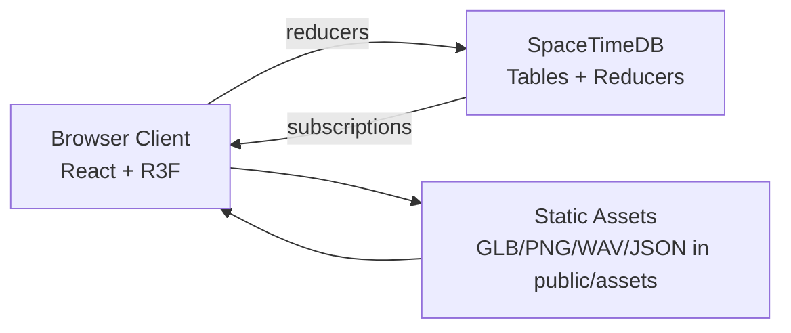

# Architecture

## Overview

The MVP uses a client-predicted browser game with SpaceTimeDB as the realtime persistence and synchronization layer.

## App Flow

1. **Pre-race menu** — pick mode, track, display name, and room slug.
2. **Join room** — `join_or_create_room` reducer creates or reuses a SpaceTimeDB room.
3. **Race session** — `RacingScene` runs local driving, publishes transforms, records checkpoints and laps.
4. **HUD / leaderboard** — telemetry and lap results render from subscribed tables.

## Game Modes

| Mode       | Default track      | Description                                             |
| ---------- | ------------------ | ------------------------------------------------------- |
| `circuit`  | City Loop V1       | Mapped circuits and the city loop with checkpoint gates |
| `stunt`    | Stunt Showcase     | Elevated stunt geometry with loops and corkscrews       |
| `practice` | Flat Road Practice | Flat road-only layout for car feel testing              |

Track definitions live in `src/game/track.ts`. Circuit routes load JSON map data from `public/assets/circuit/maps/`.

## Client Modules

| Module                      | Role                                                    |
| --------------------------- | ------------------------------------------------------- |
| `src/App.tsx`               | Pre-race menu, SpaceTimeDB subscriptions, session shell |
| `src/game/driving.ts`       | Keyboard event → driving action → `VehicleInput`        |
| `src/game/vehicle.ts`       | Kinematic car step, handbrake, checkpoint reset helper  |
| `src/game/track.ts`         | Track registry, checkpoints, city asset placements      |
| `src/game/CircuitTrack.tsx` | Parse circuit JSON and build road mesh                  |
| `src/game/StuntTrack.tsx`   | Procedural stunt route mesh                             |
| `src/game/RacingScene.tsx`  | Scene graph, camera, audio, multiplayer sync loop       |
| `src/game/network.ts`       | Snapshot shaping and remote car interpolation           |
| `src/game/assets.ts`        | Runtime asset path manifest                             |

## Client Responsibilities

- Render the scene with React Three Fiber and Three.js.
- Load GLB models, textures, skybox, sounds, and circuit map JSON from `public/assets/`.
- Run local car controls, camera modes, visual effects, and HUD.
- Send transform snapshots to SpaceTimeDB at a throttled rate.
- Send race events: room join, checkpoint reached, lap finished.
- Subscribe to room, car state, and leaderboard tables.
- Interpolate remote cars to hide network jitter.

## SpaceTimeDB Responsibilities

- Track connected player identities.
- Store player names and online state.
- Own room membership.
- Store latest car transform snapshots per active player.
- Store checkpoint and lap result events.
- Store ghost frames for replay and leaderboard comparison.
- Reject reducer calls from players that are not in the target room.

## Asset Boundary

SpaceTimeDB does not store GLB files, textures, audio, or circuit map JSON. It stores compact metadata and race events only. The browser resolves asset paths from `src/game/assets.ts` and `src/game/track.ts`.

## Networking Model

The MVP uses client-published transforms:

- Local client simulates the car every animation frame via `stepVehicle`.
- Client publishes position/rotation/velocity roughly 10–20 times per second.
- Remote clients interpolate between the latest snapshots.
- SpaceTimeDB stores the latest snapshot and broadcasts row updates through subscriptions.

## Hosting Model

- SpaceTimeDB module: publish to your chosen server; database name lives in `.env.local` only.
- Client: static Vite build on a web host.
- Client env vars (see `.env.example`): `VITE_SPACETIMEDB_HOST`, `VITE_SPACETIMEDB_DB_NAME`.

Exact URI should be verified from SpaceTimeDB publish output before final deployment.
